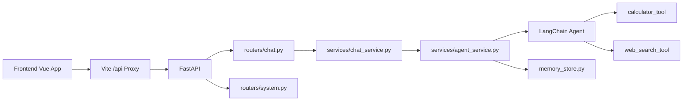

# StudyMate Agent (Slim Edition)

一个前后端分离的学习助手项目：
- 前端：Vue 3 + Vite 聊天界面
- 后端：FastAPI + LangChain Agent
- 能力：单轮对话、会话对话、工具调用（计算 + Web 搜索）

## 当前版本目标
这个版本是“瘦身版”，只保留前端实际使用的后端主链路，方便部署、维护和继续演进。

## 工业化落地文档
- 计划书与开发边界：[`docs/industrial_product_plan.md`](docs/industrial_product_plan.md)
- 路线图与任务清单（Backlog）：[`docs/roadmap_backlog.md`](docs/roadmap_backlog.md)

## 后端接口（瘦身后）
- `GET /` 服务信息
- `GET /health` 健康检查
- `POST /chat/agent` 单轮对话
- `POST /chat/agent/session` 会话对话

## 项目结构
```txt
my-agent/
├─ .env
├─ .env.example
├─ README.md
├─ docs/
│  └─ architecture.md
├─ backend/
│  ├─ README.md
│  ├─ init_chat_memory.sql
│  ├─ pytest.ini
│  └─ app/
│     ├─ main.py
│     ├─ core/
│     ├─ routers/
│     ├─ services/
│     ├─ schemas/
│     ├─ tools/
│     └─ tests/
└─ frontend/
   ├─ README.md
   ├─ package.json
   └─ src/
```

## 快速启动

### 1) 安装后端依赖
```bash
pip install fastapi "uvicorn[standard]" openai python-dotenv \
  langchain langchain-openai langgraph tavily-python psycopg[binary] psycopg-pool redis
```

### 2) 启动后端
```bash
uvicorn app.main:app --reload --app-dir backend --port 8000
```

### 3) 启动前端
```bash
cd frontend
npm install
npm run dev
```

前端默认地址：`http://127.0.0.1:5173`

## 环境变量
复制根目录 `.env.example` 到 `.env` 并填入你的密钥与连接信息。

关键变量：
- `DASHSCOPE_API_KEY`：模型调用密钥
- `TAVILY_API_KEY`：Web 搜索密钥
- `POSTGRES_URL` / `REDIS_URL`：会话记忆存储（可选）
- `VITE_API_BASE_URL`：前端请求前缀（默认 `/api`）

## 架构图


完整版本见 [docs/architecture.md](docs/architecture.md)。

## 子模块说明
- 后端说明：`backend/README.md`
- 前端说明：`frontend/README.md`

## 本地验证
```bash
# 语法检查
python -m compileall -q backend/app

# 如安装了 pytest
cd backend
python -m pytest -q
```

## 说明
当前仓库已做接口与模块瘦身，删除了未被前端使用的实验性链路，保留核心可用能力。
