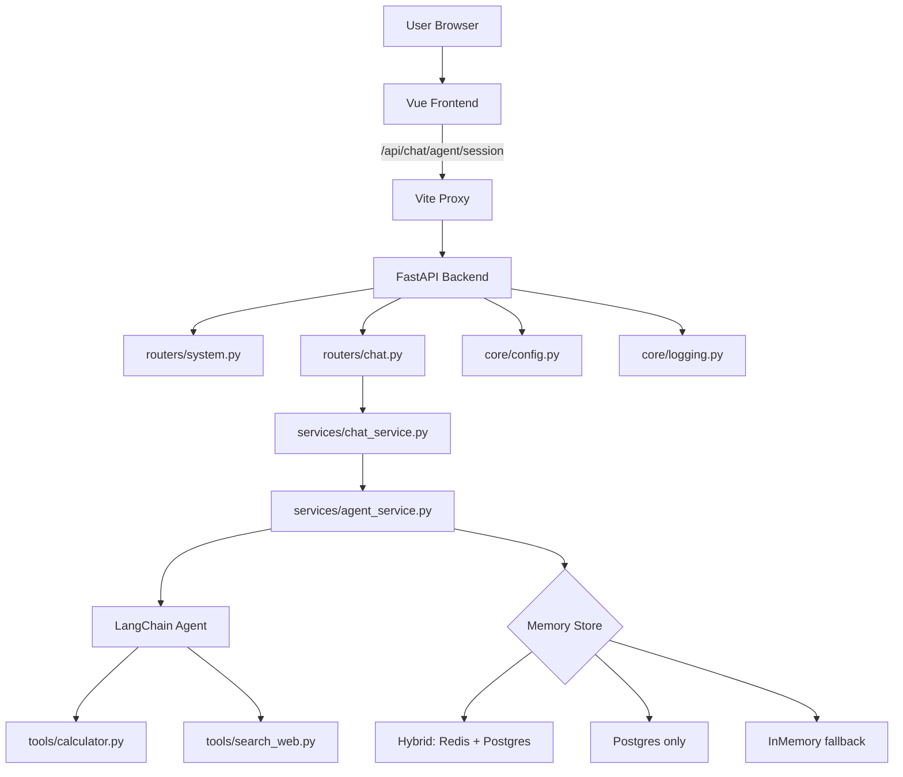

# 项目架构图（瘦身版）

```mermaid
flowchart TD
  U[User Browser] --> F[Vue Frontend]
  F -->|/api/chat/agent/session| V[Vite Proxy]
  V --> B[FastAPI Backend]

  B --> R1[routers/system.py]
  B --> R2[routers/chat.py]

  R2 --> S1[services/chat_service.py]
  S1 --> S2[services/agent_service.py]

  S2 --> L[LangChain Agent]
  L --> T1[tools/calculator.py]
  L --> T2[tools/search_web.py]

  S2 --> M{Memory Store}
  M --> H[Hybrid: Redis + Postgres]
  M --> P[Postgres only]
  M --> I[InMemory fallback]

  B --> C[core/config.py]
  B --> LOG[core/logging.py]
```

说明：
- 前端默认通过 `/api` 代理请求后端。
- 后端接口瘦身后，仅保留聊天核心链路与健康检查。
- 会话记忆按配置自动选择存储后端，并带回退策略。
